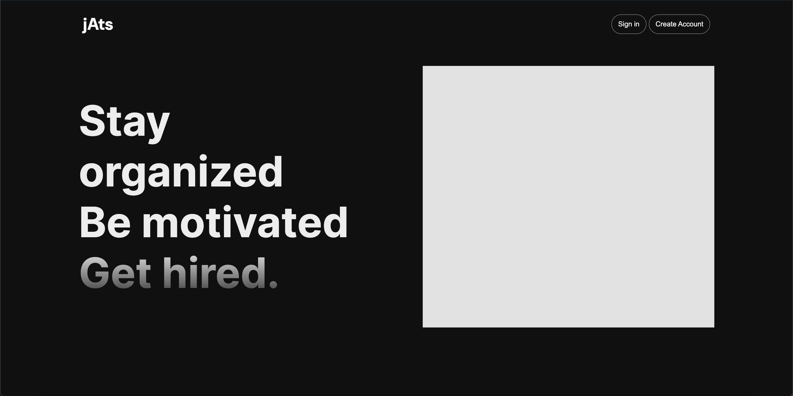
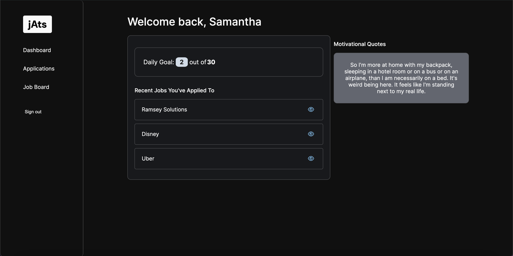
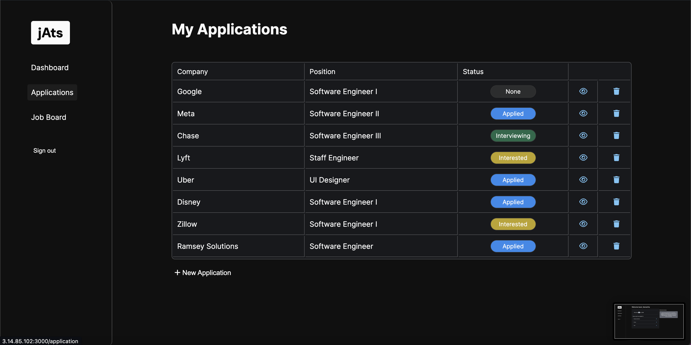
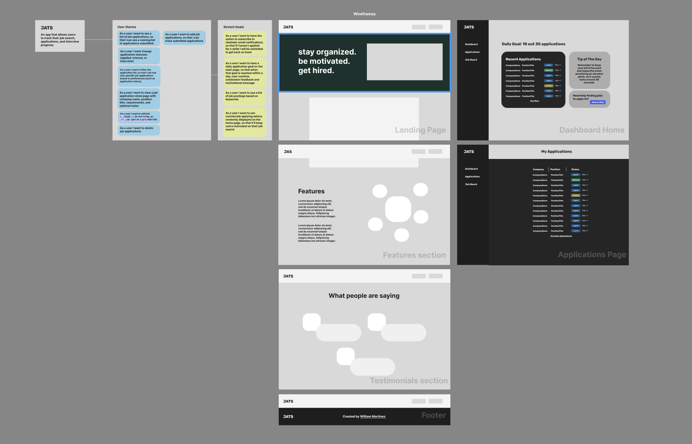

# JATS - Job Application Tracking System
Keeping track of applications when conducting a job search could be a pain. After applying to 200 jobs how could you possibly keep track of them all or remember specific details about each one? JATS seeks to improve the process of searching for a job by tracking user submitted application entries.

### Planning and Wireframes
[See Figma](https://www.figma.com/file/NEK4haZw6RvMQXsxyLRjfs/JATS?type=design&node-id=0-1&mode=design&t=rRdju4l3kK78qvhp-0)

### Getting Started
Test Email: sgray@gmail.com
Test Password: test123

[Deployed App](3.14.85.102:3000/)

### Technologies Used
- MongoDB
- EJS
- NodeJS
- [Quote Garden API](https://github.com/pprathameshmore/QuoteGarden/tree/master) for Motivation Quotes

### Attribution
[Font Awesome](https://fontawesome.com/) for Icons

### Future Features
- [] Filter job entries based on status
- [] Limit quotes to quotes related to job searching
- [] Create personalized profiles based on desired position
- [] Add page that fetches and shares resources based on desired position
